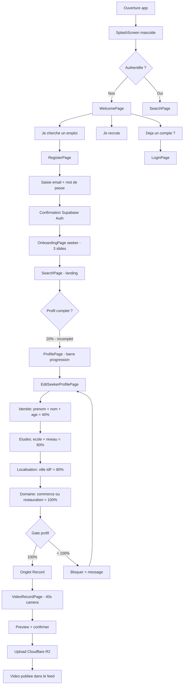
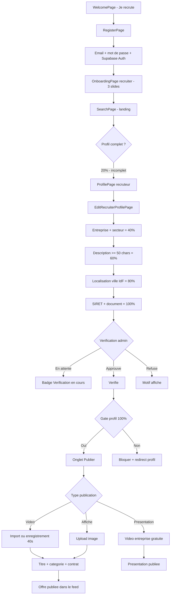
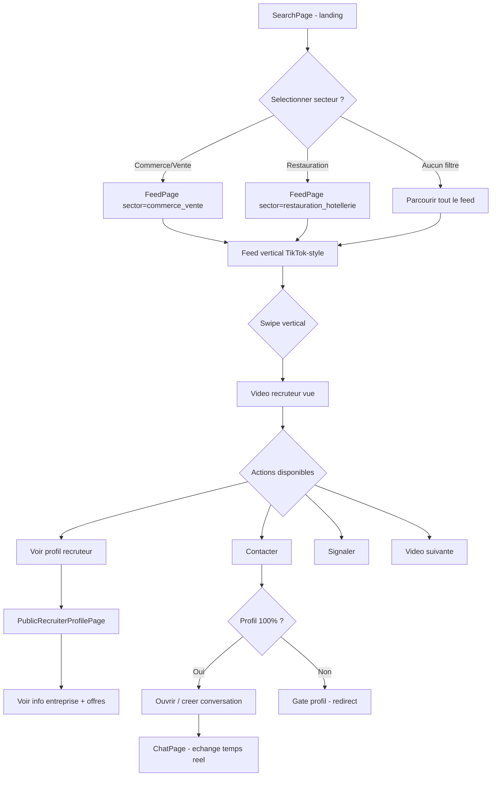
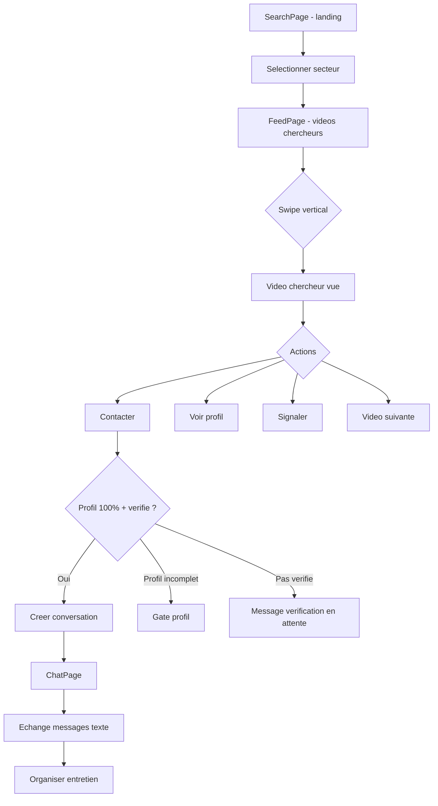
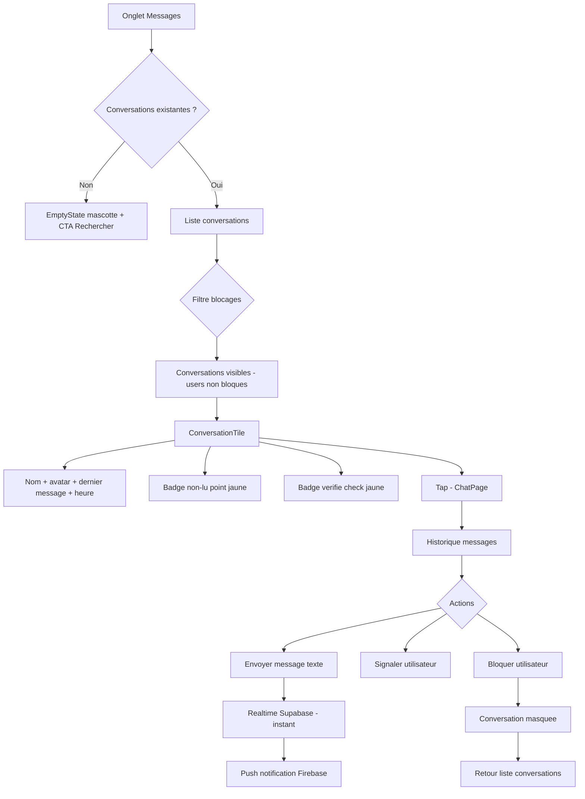

# UX Design Specification - Etoile Mobile App

**Author:** Sally (UX Designer)
**Date:** 2026-02-27

---

## Executive Summary

### Project Vision

Etoile est une application mobile de recrutement par video courte (40 secondes, style TikTok) destinee au marche francais. Elle donne a chaque chercheur d'emploi 40 secondes pour briller — pas de CV formate, pas de lettre de motivation — juste eux, face camera.

**Pivot Beta** : L'app cible specifiquement les chercheurs d'alternance en Ile-de-France, dans 2 secteurs : Commerce/Vente et Restauration/Hotellerie. Ce recentrage maximise la densite d'utilisateurs dans un segment precis avant expansion.

**Modele B2B** : Les chercheurs sont 100% gratuits, seuls les recruteurs paient. Le chercheur ne doit jamais ressentir de friction commerciale.

### Target Users

| | Chercheur (Seeker) | Recruteur (Recruiter) |
|---|---|---|
| **Qui** | Jeune en recherche d'alternance, IdF | Entreprise Commerce/Vente ou Restauration/Hotellerie, IdF |
| **Besoin** | Se demarquer sans CV, montrer sa personnalite | Trouver des candidats motives rapidement |
| **Frustration actuelle** | CV anonymes, pas de retour, processus lent | Pile de CV identiques, entretiens chronophages |
| **Niveau tech** | Natif digital, habitue TikTok/Instagram | Variable, doit etre simple |
| **Device** | Mobile (90%+) | Mobile + desktop possible |
| **Moment d'usage** | Transport, pauses, soiree | Bureau, entre RDV |

### Key Design Challenges

1. **Le paradoxe de la SearchPage** : Page de recherche comme landing avec seulement 2 secteurs et une localisation fixe (IdF). L'utilisateur a-t-il vraiment besoin de "chercher" avec si peu d'options, ou est-ce une friction inutile avant d'atteindre le contenu ?

2. **Le gate profil a 100%** : 5 categories x 20% avant de pouvoir publier ou contacter — protecteur pour la qualite, mais potentiellement frustrant pour un jeune presse. Le parcours de completude doit etre fluide et motivant, pas un formulaire administratif.

3. **Le feed avec peu de contenu (cold start)** : En beta, peu de videos. Un feed vertical style TikTok avec 3 videos parait vide. Comment gerer la perception de vide sans decevoir ?

4. **Coherence visuelle post-pivot** : Le design draft original prevoyait 16 secteurs, des filtres complexes, un feed direct. L'app a pivote — l'UI doit refleter cette simplification avec elegance, pas comme un "appauvrissement".

5. **Camera (Story 13.1 reportee)** : Le coeur de la proposition de valeur — l'enregistrement video in-app — n'est pas encore implemente. C'est le moment UX le plus critique de toute l'app.

### Design Opportunities

1. **L'onboarding comme moment fondateur** : Mascotte, coaching video en 3 phases, ton chaleureux — un premier contact memorable qui distingue Etoile de toutes les apps emploi existantes.

2. **La simplicite comme force** : 2 secteurs, 1 region, pas de filtres complexes. Opportunite de creer une experience epuree — "ouvrir l'app, voir des candidats, contacter" en moins de 30 secondes.

3. **Le profil comme storytelling** : Le profil seeker (prenom, age, ecole, niveau, ville, domaine) peut devenir une mini-carte d'identite visuelle qui raconte une histoire, pas un formulaire froid.

4. **La mascotte comme fil conducteur** : Deja presente dans l'onboarding et les empty states — elle peut devenir le guide emotionnel de toute l'experience (encouragements, erreurs, succes).

---

## Core User Experience

### Defining Experience

**Chercheur** : *"Ouvrir l'app, enregistrer 40 secondes, publier."*
C'est le moment ou quelqu'un passe de l'invisibilite a la visibilite. Si cette action est stressante, compliquee, ou longue — on a perdu.

**Recruteur** : *"Ouvrir l'app, scroller le feed, contacter."*
C'est le moment ou un recruteur passe de "encore un CV" a "je veux lui parler". Si ca prend plus de 30 secondes entre la decouverte et le message — on a perdu.

**L'interaction critique** : L'enregistrement video. C'est le moment le plus vulnerable — un jeune face a sa camera, potentiellement stresse. Le coaching en 3 phases (10s presentation, 20s competences, 10s conclusion) transforme l'anxiete en confiance guidee.

### Platform Strategy

| Aspect | Decision |
|--------|----------|
| **Plateforme primaire** | Mobile (iOS + Android via Flutter) |
| **Input principal** | Touch-based, gestes naturels (swipe, tap) |
| **Capacites device** | Camera (enregistrement video), Push notifications, Geolocalisation (ville IdF) |
| **Offline** | Non requis MVP — connexion necessaire pour feed et messages |
| **Orientation** | Portrait obligatoire pour enregistrement, portrait pour toute l'app |
| **Web** | Fonctionne via Flutter web (test Edge), experience optimisee mobile |

### Effortless Interactions

| Interaction | Friction cible | Etat actuel |
|---|---|---|
| Demarrer un enregistrement | < 3 taps depuis l'accueil | Onglet "Enregistrer" en bottom nav (1 tap) |
| Parcourir le feed | 0 apprentissage (style TikTok) | Feed vertical avec swipe — implemente |
| Contacter depuis le feed | 2 taps max | Bouton "Postuler/Contacter" sur chaque video |
| Repondre a un message | < 10 secondes | Chat temps reel Supabase — implemente |
| Completer son profil | Guidage progressif | 5 categories x 20%, card de progression visible |
| Trouver des candidats | SearchPage → Feed filtre | SearchPage landing → Feed avec initialSector |

**Automatisations (zero intervention)** :
- Inscription donne 20% de completude automatiquement
- Filtres pre-remplis selon le profil (secteur/domaine)
- Notifications push sur nouveau message
- Badge verifie automatique apres validation admin

### Critical Success Moments

| Moment | Utilisateur | Emotion cible | Si on echoue... |
|---|---|---|---|
| **Premiere video publiee** | Chercheur | Fierte, accomplissement | Il ne revient jamais |
| **Premier message recu** | Chercheur | Excitation, validation | Il pense que l'app ne marche pas |
| **Decouverte d'un bon candidat** | Recruteur | Surprise positive, envie d'agir | Il retourne sur Indeed |
| **Conversation engagee** | Les deux | Confiance, progression | L'app est vue comme un gadget |
| **Profil 100% atteint** | Les deux | Sentiment d'aboutissement | Le gate semble punitif |

**Le moment make-or-break** : La premiere video publiee. Si le chercheur se sent guide, en confiance, et fier de son resultat — tout coule naturellement. S'il se sent ridicule, perdu, ou frustre — c'est fini.

### Experience Principles

#### 1. Authenticite sans Friction
> L'app permet d'etre soi-meme sans barriere technique.
- Coaching guide plutot qu'instructions complexes
- Pas de montage = pas de pression de perfection
- Re-enregistrement illimite = liberte d'essayer

#### 2. Voir et Agir
> Chaque video vue peut mener a une action immediate.
- Bouton contact toujours visible sur le feed
- Zero etape entre interet et message
- Templates optionnels pour accelerer sans contraindre

#### 3. Chaleur Professionnelle
> Serieux dans l'intention, bienveillant dans la forme.
- Palette jaune/orange = optimisme
- Ton encourageant ("Bravo !", "Oups, petit souci...")
- Mascotte comme compagnon, pas comme gadget

#### 4. Egalite de Lumiere
> Chaque etoile merite de briller equitablement.
- Rotation aleatoire dans les resultats
- Pas de likes/favoris = pas de hierarchie sociale
- Une video par categorie = egalite des chances

#### 5. Confiance par la Transparence
> L'utilisateur sait toujours ce qui se passe.
- Recruteurs verifies avec badge visible
- Completude profil affichee clairement (card avec %)
- Process de verification explique

---

## Desired Emotional Response

### Primary Emotional Goals

**Pour le chercheur** : Passer de l'invisibilite a la fierte d'etre vu. L'emotion dominante doit etre le **courage accompagne** — oser se montrer parce qu'on se sent guide, pas juge.

**Pour le recruteur** : Passer de la frustration du tri de CV a la **surprise positive** de decouvrir une personne reelle en 40 secondes.

**Emotion partagee** : La **confiance** — confiance que l'app est serieuse, que les profils sont authentiques, que le processus mene quelque part.

### Emotional Journey Mapping

#### Chercheur : De l'Ombre a la Lumiere

| Etape | Action | Emotion ressentie | Emotion visee |
|---|---|---|---|
| Decouverte | Telecharge l'app | Scepticisme, curiosite | *"Tiens, c'est different"* — Intrigue |
| Onboarding | Voit la mascotte, les slides | Amusement, surprise | *"C'est sympa, pas comme les autres"* — Confiance naissante |
| Profil | Remplit ses infos (5 etapes) | Routine, legere impatience | *"C'est rapide et ca a du sens"* — Motivation progressive |
| Avant la camera | Ouvre l'enregistrement | **Stress, vulnerabilite** | *"Je suis guidee, pas seule"* — Courage accompagne |
| Enregistrement | Parle face camera 40s | Concentration, auto-conscience | *"Les prompts m'aident"* — Flow guide |
| Publication | Message de succes | **Fierte** | *"J'ai ose ! Ma video est la"* — Accomplissement |
| Attente | Consulte l'app regulierement | Espoir mele d'anxiete | *"Mon profil est decouvert"* — Patience sereine |
| Premier message | Recoit un message recruteur | **Joie, validation** | *"Ca marche ! Quelqu'un m'a vue !"* — Excitation contenue |

#### Recruteur : De la Frustration a l'Efficacite

| Etape | Action | Emotion ressentie | Emotion visee |
|---|---|---|---|
| Decouverte | S'inscrit, entre le SIRET | Pragmatisme, jugement | *"C'est pro et simple"* — Credibilite |
| Premier scroll | Parcourt le feed | **Surprise positive** | *"Je vois la personne, pas un papier"* — Revelation |
| Contact | Envoie un message | Efficacite | *"2 taps et c'est fait"* — Satisfaction |
| Echange | Conversation avec le candidat | Confiance | *"On se comprend vite"* — Productivite |

### Micro-Emotions

| Micro-emotion | Moment | Traitement UX |
|---|---|---|
| **Confiance** (vs Confusion) | Navigation, premiers pas | Bottom nav claire, parcours lineaire |
| **Fierte** (vs Honte) | Publication video | Message "Bravo !", animation subtile, re-enregistrement possible |
| **Serenite** (vs Anxiete) | Attente de reponses | "Votre profil est decouvert" (pas de compteur anxiogene) |
| **Appartenance** (vs Isolation) | Utilisation quotidienne | Mascotte comme compagnon, ton chaleureux |
| **Controle** (vs Impuissance) | Gate profil, filtres | Barre de progression visible, etapes claires |
| **Securite** (vs Mefiance) | Conversations avec inconnus | Badge verifie, Signaler/Bloquer visible |

### Design Implications

**Emotions a absolument eviter :**

| Emotion toxique | Declencheur | Prevention |
|---|---|---|
| **Humiliation** | Se revoir en video | Re-enregistrement illimite, prompts guidants, pas de commentaires publics |
| **Frustration** | Formulaire trop long, gate incomprehensible | Profil en 5 categories courtes, explication du "pourquoi" |
| **Abandon** | Feed vide, aucune reponse | Empty states encourageants avec mascotte, notifications proactives |
| **Mefiance** | Recruteur douteux, spam | SIRET verifie, badge visible, blocage facile |
| **Comparaison sociale** | "Meilleures" videos en premier | Pas de likes, rotation aleatoire, pas de compteur public |

**Connexion emotion → design :**

| Emotion visee | Choix UX |
|---|---|
| Confiance guidee | Coaching 3 phases + timer visible + indicateur de progression |
| Fierte celebree | Animation subtile post-publication + "Bravo !" + mascotte |
| Patience sereine | Empty state "Votre profil est decouvert" (pas "0 vues") |
| Surprise positive | Feed video immersif — personne reelle vs CV papier |
| Efficacite chaleureuse | Templates messages optionnels + CTA direct + ton humain |
| Securite discrete | Badge verifie visible + Signaler en 2 taps + pas de popup intrusif |

### Emotional Design Principles

1. **Jamais d'emotion negative non resolue** : Chaque erreur accompagnee d'une solution claire et d'un ton humain ("Oups, petit souci. On reessaie ?")

2. **Celebrer les micro-victoires** : Profil 40% → 60% merite un encouragement. Pas juste a 100%.

3. **Le silence n'est pas un vide** : Quand il n'y a pas de message/resultat, la mascotte comble le vide emotionnel avec un message positif tourne vers l'avenir.

4. **La vulnerabilite est une force** : L'acte de se filmer est courageux. Le design doit honorer ce courage, jamais le banaliser.

---

## UX Pattern Analysis & Inspiration

### Inspiring Products Analysis

#### 1. TikTok — Le feed vertical comme langage universel

- Le swipe vertical est un reflexe musculaire pour la Gen Z — zero apprentissage
- Contenu demarre instantanement, pas de buffering ni de splash intermediaire
- Overlay d'infos en bas de video discret mais suffisant (nom, description)
- Mode "For You" fait tout le travail de decouverte

**Pour Etoile** : Feed vertical plein ecran avec overlay info (implemente). Demarrage video instantane, preload suivante.
**Ce qu'on ne prend PAS** : Likes, commentaires, compteurs publics, algorithme addictif.

#### 2. Duolingo — La mascotte qui rend le difficile amusant

- La mascotte (Duo) est partout : onboarding, encouragements, rappels, erreurs
- Micro-victoires celebrees (animations, streaks, confettis subtils)
- Ton chaleureux et humain — "Bravo !", "Tu y es presque !", jamais "Echec"
- Progression visible et motivante (barres, pourcentages, niveaux)

**Pour Etoile** : Mascotte comme compagnon emotionnel (en place). Celebrer les micro-victoires. Ton bienveillant. Barre completude comme moteur.
**Ce qu'on adapte** : Pas de gamification agressive (pas de streaks, pas de classements) — respect du contexte pro.

#### 3. Indeed/HelloWork — La simplicite de la recherche d'emploi

- Champ de recherche "Quoi + Ou" immediatement visible
- Resultats clairs et scannables (titre, entreprise, lieu, resume)
- Filtre simple, ne noie pas l'utilisateur
- Postulation en "1 clic" reduit la friction

**Pour Etoile** : SearchPage avec filtre secteur + localisation (implemente). Contact en minimum de taps.
**Ce qu'on fait MIEUX** : Video au lieu du texte, experience immersive plein ecran, contact direct par messagerie.

#### 4. WhatsApp — La messagerie qui "juste marche"

- Liste conversations lisible (avatar, nom, dernier message, heure)
- Indicateurs de lecture donnent du feedback sans intrusion
- Envoi de message instantane (optimistic UI)
- Blocage/signalement accessible mais pas envahissant

**Pour Etoile** : Layout conversations identique (implemente). Feedback temps reel. Blocage via menu contextuel (implemente).

### Transferable UX Patterns

| Pattern | Source | Application Etoile |
|---|---|---|
| Feed vertical plein ecran | TikTok | Feed video candidats/offres |
| Mascotte-compagnon | Duolingo | Onboarding, empty states, encouragements |
| Progression visible | Duolingo | Barre completude profil 5x20% |
| Recherche "Quoi + Ou" | Indeed | SearchPage (secteur + ville IdF) |
| Contact 1-clic | Indeed/LinkedIn | Bouton Postuler/Contacter direct sur le feed |
| Coaching guide | Duolingo (lecons) | Enregistrement video 3 phases avec prompts |
| Liste conversations | WhatsApp | ConversationsPage avec avatar + dernier message |
| Overlay info discret | TikTok | Nom + domaine + ville en bas de chaque video |

### Anti-Patterns to Avoid

| Anti-pattern | Pourquoi c'est nocif | Reference |
|---|---|---|
| Compteurs publics (likes, vues) | Hierarchie sociale, anxiete de performance | Instagram, TikTok |
| Algorithme addictif | Etoile doit etre utile, pas addictif | TikTok, YouTube Shorts |
| Formulaire fleuve | Tue la motivation, abandon eleve | Sites emploi classiques |
| Mur payant visible | Le chercheur gratuit ne doit jamais se sentir "limite" | LinkedIn (InMail) |
| Notifications spam | Erosion confiance, desinstallation | Indeed (alertes non pertinentes) |
| Dark patterns | Contraire a Confiance par la Transparence | Services freemium |
| Auto-play audio | Surprise desagreable metro/bureau | Certaines apps video |

### Design Inspiration Strategy

**Adopter tel quel :**
- Feed vertical swipe (TikTok) — standard de l'industrie pour la video courte
- Liste conversations type WhatsApp — pattern universel et attendu
- Recherche Quoi+Ou (Indeed) — intuitive pour l'emploi

**Adapter au contexte :**
- Mascotte Duolingo → mascotte Etoile avec ton "Chaleur Professionnelle" (pas infantile)
- Progression Duolingo → completude profil 5x20% (pas de gamification excessive)
- Contact Indeed → CTA direct sur video avec templates optionnels

**Inventer (unique a Etoile) :**
- Coaching video en 3 phases (10s/20s/10s) — n'existe nulle part
- Egalite de Lumiere (rotation aleatoire, pas de metriques sociales) — a contre-courant
- SearchPage comme sas de preparation (moment de choix, pas juste un moteur)

---

## Design System Foundation

### Design System Choice

**Material Design 3 thematise** via Flutter ThemeData, enrichi de composants custom Etoile.

Approche hybride : composants Material standard comme fondation + composants custom pour les interactions specifiques a Etoile (feed video, coaching camera, profil gate, empty states avec mascotte).

### Rationale for Selection

| Facteur | Justification |
|---|---|
| **Plateforme** | Flutter = Material natif, zero friction d'integration |
| **Equipe** | Developpeur solo = besoin de composants prets a l'emploi |
| **Accessibilite** | Material a l'accessibilite built-in (WCAG, tailles tactiles, semantics) |
| **Familiarite** | Gen Z familiere avec Material (Android) + iOS-friendly via Flutter |
| **Etat actuel** | Deja implemente et fonctionnel (`app_theme.dart` avec AppColors, AppSpacing) |
| **Timeline** | Beta imminente = vitesse > reinvention |

### Implementation Approach

```
Material Design 3 (fondation)
    └── ThemeData Etoile (couleurs, typo, spacing)
        └── Composants Material thematises (AppBar, Cards, Buttons, etc.)
            └── Composants custom Etoile (FeedPlayer, ProfileGate, EmptyState, etc.)
```

- **Fondation** : `ThemeData` avec `ColorScheme` + overrides manuels
- **Tokens** : `AppColors`, `AppTheme.spaceSm/Md/Lg` comme constantes partagees
- **Composants Material** : utilises directement avec theme applique
- **Composants custom** : `shared/widgets/` pour les patterns specifiques Etoile

**Composants custom specifiques :**

| Composant | Raison |
|---|---|
| FeedVideoPlayer | Lecture video plein ecran avec overlay — n'existe pas dans Material |
| CityAutocompleteField | Autocompletion Photon API avec bbox IdF — logique metier |
| ProfileGate | Dialog bloquant completude — pattern specifique Etoile |
| EmptyStateWidget | Mascotte + message encourageant — branding unique |
| ProfileCompletionCard | Barre % + badge — pattern custom |
| VideoCoaching (a venir) | Timer 3 phases + prompts — UX unique |

### Customization Strategy

**Couleurs :**

| Nom | Hex | Usage |
|---|---|---|
| Jaune Etoile (primaire) | `#FFB800` | CTA, accents, highlights, badge verifie |
| Orange Etoile (secondaire) | `#FF8C00` | CTA secondaire, degrades, hover |
| Noir Profond | `#1A1A1A` | Texte principal, fond video |
| Blanc Pur | `#FFFFFF` | Arriere-plans, texte sur fond sombre |
| Gris Chaud | `#6B6B6B` | Texte secondaire, placeholders |
| Gris Clair | `#F5F5F5` | Separateurs, fonds secondaires |
| Succes | `#22C55E` | Validations, confirmations |
| Erreur | `#EF4444` | Erreurs, alertes critiques |
| Warning | `#F59E0B` | Avertissements |
| Info | `#3B82F6` | Informations, liens |

**Typography** : System font (Roboto Android / SF Pro iOS) pour la performance

**Espacement** : Base 8px (spaceSm=8, spaceMd=16, spaceLg=24)

**Rayons** : 8px boutons/inputs, 16px cards, 24px modales, full avatars

**Animations** : 200-300ms ease-out pour transitions, 100ms pour micro-interactions

---

## Defining Core Experience

### Defining Experience

**Etoile pour le chercheur** : *"40 secondes pour briller devant les recruteurs"*
C'est la phrase que Lea dira a sa copine de BTS. C'est cette promesse qui fait telecharger l'app. L'enregistrement video guide de 40 secondes doit etre parfait.

**Etoile pour le recruteur** : *"Tu vois la personne, pas un CV"*
Marc le boulanger dira ca a son collegue restaurateur. Le feed video qui revele des vraies personnes en 40 secondes — c'est le moment "aha" du recruteur.

### User Mental Model

#### Le chercheur pense...

| Ce qu'il connait | Ce qu'il attend | Ou il peut etre perdu |
|---|---|---|
| TikTok (filmer une video courte) | Un bouton "Enregistrer" visible | Le coaching 3 phases (nouveau pattern) |
| Instagram Stories (se filmer) | Une preview avant publication | Pourquoi 40s et pas plus ? |
| Indeed (chercher un emploi) | Des offres d'emploi | C'est LUI qui publie, pas les entreprises |
| WhatsApp (discuter) | Repondre a un message facilement | Qui peut le contacter ? (securite) |

**Shift mental cle** : Sur Indeed, le chercheur envoie son CV aux entreprises. Sur Etoile, le chercheur publie sa video et les recruteurs viennent a lui. Renversement de pouvoir que l'onboarding doit expliquer.

#### Le recruteur pense...

| Ce qu'il connait | Ce qu'il attend | Ou il peut etre perdu |
|---|---|---|
| LinkedIn (consulter des profils) | Une liste de candidats filtrables | Feed vertical (pas une liste) |
| Indeed (poster une offre) | Un formulaire d'offre classique | Import video / affiche (format different) |
| TikTok (scroller) | Contenu qui defile | Pourquoi pas de likes ? |

### Success Criteria

#### Enregistrement video (Chercheur)

| Critere | Mesure | Objectif |
|---|---|---|
| Temps jusqu'au premier enregistrement | De l'ouverture au debut de la video | < 3 minutes |
| Taux de completion | % qui terminent les 40s une fois lance | > 80% |
| Taux de publication | % qui publient apres avoir enregistre | > 60% |
| Sentiment post-publication | Fierte, pas embarras | Message "Bravo !" |
| Re-enregistrement | Tentatives moyennes avant publication | 1-3 |

#### Feed video (Recruteur)

| Critere | Mesure | Objectif |
|---|---|---|
| Temps jusqu'au premier contact | Du premier scroll au premier message | < 2 minutes |
| Videos vues par session | Nombre de videos scrollees | 5-15 |
| Taux de contact | % de videos qui menent a un message | > 10% |
| Temps de decision | Duree de visionnage avant action | < 30s par video |

### Novel UX Patterns

| Element | Type | Detail |
|---|---|---|
| Feed vertical swipe | Established (TikTok) | Zero apprentissage |
| Messagerie 1-to-1 | Established (WhatsApp) | Pattern universel |
| SearchPage Quoi+Ou | Established (Indeed) | Intuitif pour l'emploi |
| Profil avec photo/avatar | Established (LinkedIn) | Attendu |
| **Coaching video 3 phases** | **NOVEL** | Unique a Etoile — necessite tutoriel |
| **Egalite de Lumiere (pas de likes)** | **NOVEL** | A contre-courant — necessite explication |
| Gate profil 100% | Semi-novel | Similaire apps dating mais applique au recrutement |

Pour les patterns novel, l'onboarding doit expliquer le "pourquoi" (pas juste le "comment").

### Experience Mechanics — Enregistrement video 40s

#### 1. Initiation
- **Declencheur** : Tap sur l'onglet "Enregistrer" (bottom nav, position 5)
- **Pre-requis** : Profil 100% complete (sinon ProfileGate dialog)
- **Ecran preparation** : Apercu camera + conseil "Trouvez un endroit calme" + bouton "Demarrer"
- **Emotion** : Courage accompagne

#### 2. Interaction (3 phases)

| Phase | Duree | Prompt | Indicateur | Couleur |
|---|---|---|---|---|
| 1. Presentation | 0-10s | "Presentez-vous en quelques mots" | ●○○ | Jaune #FFB800 |
| 2. Competences | 10-30s | "Parlez de vos competences cles" | ●●○ | Gradient |
| 3. Conclusion | 30-40s | "Pourquoi vous choisir ?" | ●●● | Orange #FF8C00 |

Elements visuels : Timer compte a rebours (grand, centre), barre de progression 3 segments, indicateur dots, indicateur REC rouge, bouton Annuler, auto-transition entre phases, auto-stop a 40s.

#### 3. Feedback
- Transition de phase : Changement couleur + nouveau prompt (smooth)
- Dernieres 3 secondes : Timer pulse en rouge
- Fin 40s : Stop auto → transition vers preview
- Preview : Lecture automatique de l'enregistrement
- Choix : "Re-enregistrer" (secondaire) + "Publier" (primaire gradient)

#### 4. Completion
- **Action** : Tap sur "Publier ma video"
- **Feedback immediat** : Spinner + "Publication en cours..."
- **Succes** : Animation checkmark (scale 0→1, 300ms) + "Bravo ! Votre etoile brille maintenant"
- **Apres succes** : Boutons "Voir mon profil" / "Explorer le feed"
- **Upload** : En background (pas de blocage UI)

---

## Visual Design Foundation

### Color System

**Palette implementee** dans `app_colors.dart` — alignement parfait avec le UX draft :

| Token | Hex | Usage | Emotion |
|---|---|---|---|
| `primaryYellow` | `#FFB800` | CTA, accents, badge verifie | Optimisme, chaleur |
| `primaryOrange` | `#FF8C00` | Gradient, hover, CTA secondaire | Energie, action |
| `black` | `#1A1A1A` | Texte principal, fond video | Serieux, profondeur |
| `white` | `#FFFFFF` | Arriere-plans, texte sur sombre | Clarte, espace |
| `greyWarm` | `#6B6B6B` | Texte secondaire, placeholders | Subtilite |
| `greyLight` | `#F5F5F5` | Separateurs, fonds secondaires | Separation douce |
| `greyMedium` | `#E5E5E5` | Borders, etats disabled | Neutralite |
| `success` | `#22C55E` | Validations, confirmations | Fierte |
| `error` | `#EF4444` | Erreurs, alertes critiques | Alerte sans panique |
| `warning` | `#F59E0B` | Avertissements | Attention douce |
| `info` | `#3B82F6` | Informations, liens | Confiance |

**Gradients** :
- `primaryGradient` : jaune → orange (135deg) — CTA principaux
- `videoOverlayGradient` : transparent → 70% noir — lisibilite texte sur video

**Accessibilite couleurs (WCAG AA)** :
- `#1A1A1A` sur blanc = 16.1:1 (PASS)
- `#6B6B6B` sur blanc = 5.9:1 (PASS)
- `#FFB800` sur noir = 11.3:1 (PASS)
- `#FFB800` sur blanc = 2.1:1 (FAIL — utilise uniquement comme fond avec texte noir)

### Typography System

**Police** : Inter via Google Fonts (`google_fonts` package)

| Style Material | Taille | Poids | Height | Usage Etoile |
|---|---|---|---|---|
| `displayLarge` | 32px | Bold 700 | 1.2 | Titres principaux (H1) |
| `displayMedium` | 24px | SemiBold 600 | 1.3 | Titres sections (H2) |
| `displaySmall` | 20px | SemiBold 600 | 1.4 | Titres cards (H3) |
| `bodyLarge` | 18px | Regular 400 | 1.5 | Texte important |
| `bodyMedium` | 16px | Regular 400 | 1.5 | Texte courant |
| `bodySmall` | 14px | Regular 400 | 1.5 | Texte secondaire |
| `labelLarge` | 16px | SemiBold 600 | 1.4 | Boutons |
| `labelMedium` | 12px | Medium 500 | 1.4 | Captions, legendes |
| `labelSmall` | 10px | Bold 700 | 1.2 | Badges, tags, overline |

Inter = police moderne, lisible, neutre — alignee avec le ton "Chaleur Professionnelle".

### Spacing & Layout Foundation

**Base 4px** implementee dans `app_theme.dart` :

| Token | Valeur | Usage |
|---|---|---|
| `spaceXs` | 4px | Espaces internes minimes |
| `spaceSm` | 8px | Elements proches |
| `spaceMd` | 16px | Padding standard composants |
| `spaceLg` | 24px | Entre sections |
| `spaceXl` | 32px | Marges de page |
| `space2Xl` | 48px | Grandes separations |
| `space3Xl` | 64px | Blocs majeurs |

**Rayons de bordure** :

| Token | Valeur | Usage |
|---|---|---|
| `radiusSm` | 4px | Tags, badges |
| `radiusMd` | 8px | Boutons, inputs |
| `radiusLg` | 16px | Cards, dialogs |
| `radiusXl` | 24px | Bottom sheets |
| `radiusFull` | 9999px | Avatars, pills |

**Ombres** : 4 niveaux (sm/md/lg/xl) — subtils, coherents avec le ton chaleureux.

**Themes** : Light (principal) + Dark (defini mais non active par defaut).

### Accessibility Considerations

**Contrastes** : Tous les textes sur fond respectent WCAG AA (4.5:1 minimum). Le jaune primaire n'est jamais utilise comme couleur de texte sur fond clair — toujours comme fond avec texte noir.

**Tailles tactiles** : Tous les boutons Material respectent 48x48px minimum via le ThemeData (padding genere la zone tactile).

**Support lecteur ecran** : Flutter Material widgets incluent les Semantics natifs. Les composants custom doivent ajouter des labels descriptifs.

**Points d'amelioration identifies** :
1. `google_fonts` charge Inter via reseau — considerer bundling local pour perf/offline
2. `primaryGradient` defini mais non applique aux ElevatedButton par defaut — utiliser Container+decoration pour les CTA importants
3. Dark mode present mais non active — a confirmer pour la beta

---

## Design Direction Decision

### Design Directions Explored

Audit page par page de l'app existante (18 sprints implementes) comparant l'implementation au design spec et aux objectifs emotionnels :

1. **SearchPage (landing)** : Mascotte + dropdown secteur + badge IdF + CTA. Correct mais basique — friction potentielle avec seulement 2 options de secteur.
2. **FeedPage (coeur)** : Cards video avec overlay info, pas un vrai feed plein ecran TikTok. Ecart avec le design spec, acceptable pour la beta.
3. **ProfilePage** : Card completude avec % + progress bar + badge "Profil complet". Excellent alignement Duolingo.
4. **ConversationsPage + ChatPage** : Pattern WhatsApp classique. Parfait. Empty state avec mascotte aligne.
5. **WelcomePage + OnboardingPage** : Mascotte + slides role-specific. Moment fondateur present.
6. **Formulaires profil** : 5 champs courts, dropdowns + autocomplete ville. Pas de formulaire fleuve.

### Chosen Direction

**"Chaleur Fonctionnelle"** — equilibre entre :
- Material Design comme socle solide et familier
- Mascotte + ton chaleureux comme personnalite unique
- Jaune/Orange comme signature visuelle optimiste
- Simplicite des interactions (peu de filtres, CTA directs)

Direction validee pour la beta. L'app est coherente et fonctionnelle — pas de revolution necessaire, mais des ameliorations ciblees.

### Design Rationale

L'app a evolue pragmatiquement sur 18 sprints. Le design s'est construit incrementalement autour de Material Design theme, avec la mascotte et le ton chaleureux comme differenciateurs. Le pivot beta (2 secteurs, IdF uniquement) a simplifie l'interface naturellement. La direction "Chaleur Fonctionnelle" tire parti de cette simplicite au lieu de la combattre.

### Implementation Approach — Ameliorations prioritaires

| Priorite | Amelioration | Impact | Effort |
|---|---|---|---|
| P1 | Messages envoyes avec gradient jaune→orange | Personnalite visuelle | Faible |
| P2 | Mascotte aux paliers profil (40%, 60%, 80%) | Motivation, micro-victoires | Moyen |
| P3 | Lien "Parcourir tout le feed" sur SearchPage | Reduction friction | Faible |
| P4 | Mini progress bar sur formulaires profil | Sentiment de progression | Faible |
| P5 | Bundler Inter en local (perf/offline) | Performance, fiabilite | Moyen |

---

## User Journey Flows

### Parcours PRD vs Implementation reelle

Le PRD definit 2 journeys principaux. L'implementation actuelle (Sprints 1-18, pivot beta) presente des ecarts documentes :

| PRD | Implementation reelle |
|-----|----------------------|
| OTP email + SMS | Email/password + Supabase Auth (pas d'OTP SMS) |
| Choix du role dans l'inscription | WelcomePage → 2 boutons "Je cherche"/"Je recrute" → meme RegisterPage |
| Completude 40% apres inscription | 20% inscription seule (5x20%) |
| Photo de profil = 20% | Remplace par domaine (seeker) ou description>=50 chars (recruiter) |
| Dossiers candidature | Non implemente (MVP futur) |
| Alertes filtrees | Non implemente (MVP futur) |

**5 parcours critiques identifies :**

1. Onboarding Chercheur — Welcome → profil 100% → premiere video
2. Onboarding Recruteur — Welcome → profil 100% → premiere publication
3. Decouverte & Candidature (Chercheur) — SearchPage → feed → contacter
4. Decouverte & Contact (Recruteur) — SearchPage → feed → contacter
5. Messagerie — Conversations → chat temps reel

---

### Journey 1 : Onboarding Chercheur

**Objectif** : De l'installation a la premiere video publiee en < 10 minutes.



**Points de friction identifies :**

1. **Post-inscription sans guidage** : Apres l'inscription, l'utilisateur arrive sur SearchPage mais son profil est a 20%. Aucun guidage vers le profil — il doit naviguer seul vers l'onglet Profil.
2. **Gate tardif** : Le gate profil ne se declenche qu'au moment de publier/contacter. L'utilisateur peut naviguer 10 minutes sans savoir qu'il est bloque.
3. **Formulaire dense** : 5 champs a remplir (identite + etudes + localisation + domaine) sur une seule page — potentiellement decourageant pour un jeune presse.

**Optimisations proposees :**

- Post-inscription, rediriger vers le profil (pas SearchPage) avec message motivant de la mascotte
- Afficher un bottom sheet de rappel completude au premier acces au feed
- Progress bar visible dans l'AppBar pendant l'edition profil

---

### Journey 2 : Onboarding Recruteur

**Objectif** : De l'inscription a la premiere offre publiee.



**Points de friction identifies :**

1. **Verification asynchrone** : La verification SIRET est manuelle (admin). Le recruteur peut avoir 100% de completude mais etre bloque en attente — frustration si pas d'indication claire du delai.
2. **3 types de publication** : Le recruteur doit naviguer entre video, affiche, et presentation — l'UI doit guider clairement.
3. **Meme RegisterPage** : Le bouton "Je recrute" va vers la meme RegisterPage que le chercheur — pas de distinction du role a l'inscription visible.

**Optimisations proposees :**

- Afficher delai estime de verification ("sous 24-48h ouvrees")
- Email ou push notification des que la verification est traitee
- Permettre de pre-remplir l'offre en attente de verification (publier des validation)

---

### Journey 3 : Decouverte & Candidature (Chercheur)

**Objectif** : Trouver et contacter un recruteur en < 3 actions depuis le landing.



**Points de friction identifies :**

1. **SearchPage intermediaire** : Avec seulement 2 secteurs et une localisation fixe (IdF), la SearchPage ajoute un ecran avant le contenu — presque un clic de trop.
2. **Pas de "Postuler" formel** : Seulement "Contacter" (les dossiers candidature ne sont pas encore implementes).

**Optimisations proposees :**

- Rendre le lien "Parcourir tout le feed" plus visible (bouton secondaire au lieu de TextButton)
- Sur le feed, ajouter un indicateur visuel du type de contrat (badge Alternance) pour le contexte beta

---

### Journey 4 : Decouverte & Contact (Recruteur)

**Objectif** : Trouver un candidat et le contacter rapidement.



**Specificite recruteur** : Double gate — profil 100% ET verification SIRET. Un recruteur avec profil complet mais SIRET en attente ne peut pas contacter.

---

### Journey 5 : Messagerie

**Objectif** : Echange fluide et temps reel entre les deux roles.



---

### Journey Patterns

**Patterns reutilisables identifies a travers les 5 parcours :**

**1. Pattern "Gate & Guide"**
- Declenchement : action bloquee (publier, contacter)
- Comportement : message explicatif + redirection vers le profil
- Utilise dans : Journey 1, 2, 3, 4

**2. Pattern "Empty State + CTA"**
- Declenchement : liste vide (conversations, feed, publications)
- Comportement : mascotte + texte encourageant + bouton d'action
- Utilise dans : Journey 3, 5

**3. Pattern "Feed Vertical"**
- Declenchement : acces au contenu (videos chercheurs ou recruteurs)
- Comportement : swipe vertical, lecture auto, actions overlay
- Utilise dans : Journey 3, 4

**4. Pattern "Onboarding Progressif"**
- Declenchement : premiere connexion
- Comportement : 3 slides adaptes au role + skip + dots indicator
- Utilise dans : Journey 1, 2

**5. Pattern "Realtime Feedback"**
- Declenchement : envoi message, arrivee notification
- Comportement : mise a jour instantanee via Supabase Realtime
- Utilise dans : Journey 5

---

### Flow Optimization Principles

| Principe | Application |
|----------|-------------|
| **Minimum Steps to Value** | Le chercheur doit atteindre le feed en 2 taps max (SearchPage → Feed). Le "Parcourir tout" est le raccourci. |
| **Progressive Disclosure** | Ne montrer les options premium qu'apres la premiere utilisation gratuite reussie. |
| **Clear Feedback** | Chaque action de completion profil met a jour la barre en temps reel (pas de reload). |
| **Error Prevention** | Gate profil AVANT l'action (pas pendant l'upload). Eviter les erreurs couteuses. |
| **Delight Moments** | Badge "Profil complet" vert quand 100%, mascotte dans les etats vides, gradient jaune sur les CTA. |
| **Recovery Grace** | Video : "Recommencer" illimite. Message : retry auto si connexion perdue. Profil : sauvegarde draft. |

---

## Component Strategy

### Design System Components (Material Design 3 Flutter)

**Composants M3 utilises directement :**

| Composant M3 | Usage dans Etoile | Status |
|---|---|---|
| `AppBar` | Toutes les pages (titre + actions) | OK |
| `BottomNavigationBar` | 5 onglets (MainScaffold) | OK |
| `ElevatedButton` | WelcomePage, dialogues | OK |
| `OutlinedButton` | Actions secondaires | OK |
| `TextButton` | Liens texte | OK |
| `TextField` / `TextFormField` | Formulaires profil, auth | OK |
| `DropdownButtonFormField` | Secteur, niveau etude, contrat | OK |
| `AlertDialog` | Profile gate, confirmations | OK |
| `LinearProgressIndicator` | Completude profil | OK |
| `CircularProgressIndicator` | Chargement | OK |
| `ListTile` | Conversations, listes | OK |
| `CircleAvatar` | Avatar utilisateur | OK |
| `Divider` | Separateurs | OK |
| `RefreshIndicator` | Pull-to-refresh | OK |
| `PageView` | Onboarding slides | OK |
| `Scaffold` | Structure de base | OK |
| `SnackBar` | Feedback temporaires | OK |

### Custom Components — Existants

| Composant | Fichier | Description | Qualite |
|---|---|---|---|
| `EtoileButton` | `shared/widgets/etoile_button.dart` | Bouton primaire gradient + outlined + ghost + loading | Excellent |
| `EtoileIconButton` | `shared/widgets/etoile_button.dart` | Bouton icone circulaire | Bon |
| `EmptyStateWidget` | `shared/widgets/empty_state_widget.dart` | Etat vide (mascotte/icone + titre + CTA) + compact | Excellent |
| `ProfileGate` | `shared/widgets/profile_gate.dart` | Dialog bloquant si profil < 100% | Bon |
| `MainScaffold` | `shared/widgets/main_scaffold.dart` | Shell avec bottom nav 5 onglets role-aware | Bon |
| `CityAutocompleteField` | `shared/widgets/city_autocomplete_field.dart` | Autocomplete Photon API (bbox IdF) | Bon |
| `SplashScreen` | `shared/widgets/splash_screen.dart` | Ecran de chargement initial | Bon |
| `StatsCard` | `features/profile/presentation/widgets/stats_card.dart` | Statistiques video (seeker/recruiter) | Bon |

**Composants inline (prefixe `_`, usage unique) :**

| Composant | Page | Description |
|---|---|---|
| `_ProfileCompletionCard` | `profile_page.dart` | Barre completude + CTA |
| `_VerificationStatusCard` | `profile_page.dart` | Status SIRET (pending/rejected) |
| `_RecruiterHeader` | `profile_page.dart` | Cover + logo + nom + secteur |
| `_VideoPreviewCard` | `profile_page.dart` | Placeholder video chercheur |
| `_ProfileInfoCard` | `profile_page.dart` | Nom + domaine + localisation + etudes |
| `_PublicationSectionCard` | `profile_page.dart` | Compteur publications |
| `_ConversationTile` | `conversations_page.dart` | Tile conversation avec badge non-lu |
| `_OnboardingSlide` | `onboarding_page.dart` | Data class slide onboarding |

### Gap Analysis

Composants manquants identifies par les user journeys :

| Gap | Journey | Besoin |
|---|---|---|
| **Badge/Tag** | J3, J4 | Badge "Alternance", "Verifie", type de contrat sur le feed |
| **Bottom Sheet Info** | J1, J2 | Rappel completude au premier acces feed |
| **Confirmation Dialog** | J5 | Confirmation blocage/signalement (plus doux qu'AlertDialog) |
| **Skeleton Loader** | J3, J4 | Placeholder de chargement pour le feed |
| **Mascotte Message** | J1, J2 | Message encourageant avec mascotte (style banner) |

### Custom Components — A Creer

#### `EtoileBadge`

**Purpose :** Badge/tag compact pour informations contextuelles (type contrat, statut verification, secteur).
**Usage :** Feed overlay, profil recruteur, listes.
**Anatomie :** Container arrondi + icone optionnelle + texte.
**Etats :** Defaut, avec icone, couleurs semantiques (jaune=verifie, bleu=info, vert=actif).
**Variants :** Petit (feed overlay, height 24px), moyen (profil, height 28px), avec/sans icone.
**Accessibilite :** Semantics label pour screen readers.
**Specification :** Padding horizontal 8/12px, radius radiusSm (8px), typo bodySmall bold, background couleur withAlpha(25), texte full color.

#### `MascotteMessage`

**Purpose :** Message encourageant accompagne de la mascotte, pour moments de completion profil, premier acces, etats intermediaires.
**Usage :** Post-inscription, paliers 40%/60%/80%, premiere video.
**Anatomie :** Row [mascotte mini 48px | bulle message (titre + subtitle)].
**Etats :** Info (bleu), succes (vert), encouragement (jaune).
**Variants :** Banner (pleine largeur), inline (dans une liste).
**Accessibilite :** Semantics label, texte lisible.
**Specification :** Mascotte 48px, bulle Container avec border radius radiusLg, padding spaceMd, background semantique withAlpha(15), border semantique withAlpha(40).

#### `SkeletonLoader`

**Purpose :** Placeholder anime pendant le chargement du contenu (feed, profil, conversations).
**Usage :** Feed avant chargement videos, profil avant donnees.
**Anatomie :** Containers gris avec animation shimmer.
**Variants :** Card, ListTile, Circle (avatar), Rectangle (video).
**Accessibilite :** `Semantics(label: 'Chargement en cours')`.

### Component Implementation Strategy

**Approche :**

1. Reutiliser M3 Flutter pour tous les composants standard (boutons, champs, dialogues, navigation)
2. Customiser via ThemeData (deja fait dans `app_theme.dart`) pour le branding Etoile
3. Shared widgets (`shared/widgets/`) pour les composants metier reutilisables
4. Inline widgets (prefixe `_`) pour les composants specifiques a une seule page

**Regles de promotion :**

- Widget inline utilise dans 2+ pages → migrer vers `shared/widgets/`
- Widget shared qui depend d'un feature-specific BLoC → rester inline
- Les `_ProfileCompletionCard`, `_VerificationStatusCard` restent inline (usage unique)

### Implementation Roadmap

**Phase 1 — Core (avant beta) :**

| Composant | Priorite | Justification |
|---|---|---|
| `EtoileBadge` | P1 | Feed overlay (type contrat, verifie) — impacte J3/J4 |
| `ProfileGate` refonte BottomSheet | P2 | Moins intrusif, ton encourageant — impacte J1/J2 |
| `MascotteMessage` | P2 | Moments de completude, warmth — impacte J1/J2 |

**Phase 2 — Polish (post-beta) :**

| Composant | Priorite | Justification |
|---|---|---|
| `SkeletonLoader` | P3 | Perceived performance — impacte J3/J4/J5 |
| `EmptyStateWidget` animated | P3 | Delight — mascotte fade-in |
| Refonte `_ConversationTile` shared | P3 | Si reutilise (dossiers candidature futurs) |

**Phase 3 — Enhancement (Phase 2 produit) :**

| Composant | Priorite | Justification |
|---|---|---|
| `ConfirmationBottomSheet` | P4 | Remplacement AlertDialog pour blocage/signalement |
| `VideoThumbnail` | P4 | Mini preview video dans listes |
| `NotificationBanner` | P4 | Alertes filtrees (Epic 9) |

---

## UX Consistency Patterns

### Button Hierarchy

**3 niveaux d'action dans Etoile :**

| Niveau | Composant | Quand utiliser | Exemples |
|---|---|---|---|
| **Primaire** | `EtoileButton` (gradient jaune→orange) | Action principale de la page, 1 seule par ecran | "Rechercher", "Publier", "Enregistrer" |
| **Secondaire** | `EtoileButton.outlined` (bordure jaune) | Action importante mais pas principale | "Completer mon profil", "Modifier" |
| **Tertiaire** | `TextButton` / `EtoileButton.ghost` | Action de support, lien, navigation | "Parcourir tout", "Plus tard", "Passer" |

**Regles :**

- Maximum 1 bouton primaire par ecran visible (au-dessus du fold)
- Boutons primaires toujours full-width sur mobile (sauf dans les dialogues)
- Bouton disabled = gris, jamais invisible (l'utilisateur doit comprendre pourquoi)
- Loading state : spinner remplace le label, bouton reste visible a sa taille
- Boutons destructifs (supprimer, bloquer) utilisent `AppColors.error` en texte, jamais en background

**Placement :**

- Action principale en bas de page (avant le fold) ou en sticky bottom
- Actions secondaires sous l'action principale
- Actions tertiaires en texte centre sous les boutons

### Feedback Patterns

**4 types de feedback avec code couleur coherent :**

| Type | Couleur | Icone | Duree | Usage |
|---|---|---|---|---|
| **Succes** | `AppColors.success` (#28a745) | `Icons.check_circle` | SnackBar 3s | Profil sauvegarde, message envoye, video publiee |
| **Erreur** | `AppColors.error` (#dc3545) | `Icons.error_outline` | SnackBar persistant + action | Echec upload, erreur reseau, champ invalide |
| **Warning** | `AppColors.warning` (#FF8C00) | `Icons.warning_amber` | Banner persistant | SIRET en attente, profil incomplet |
| **Info** | `AppColors.info` (#2196F3) | `Icons.info_outline` | SnackBar 4s | Mise a jour disponible, hint contextuel |

**Regles :**

- SnackBar succes : disparait auto (3s), pas d'action requise
- SnackBar erreur : reste affiche, bouton "Reessayer" ou "Fermer"
- Banner warning : inline dans la page (pas de SnackBar), visible jusqu'a resolution
- Jamais 2 feedbacks superposes — le nouveau remplace l'ancien
- Toast/SnackBar en bas de l'ecran, au-dessus de la bottom nav

**Pattern "Gate & Guide" (specifique Etoile) :**

- Declenchement : profil < 100% + action bloquee
- Feedback : Dialog/BottomSheet avec progress bar + % + CTA "Completer"
- Ton : encourageant ("Plus que X% !"), pas punitif

### Form Patterns

**Regles de formulaire unifiees :**

| Aspect | Pattern |
|---|---|
| **Layout** | Un champ par ligne, labels au-dessus (pas floating) |
| **Validation** | En temps reel apres le premier blur (pas pendant la saisie) |
| **Erreur** | Texte rouge sous le champ, icone dans le suffixe |
| **Succes champ** | Pas d'indicateur individuel (eviter le bruit visuel) |
| **Required** | Tous les champs sont requis sauf mention contraire |
| **Dropdown** | `DropdownButtonFormField` avec `initialValue`, garde contre valeurs inconnues |
| **Autocomplete** | `CityAutocompleteField` pattern : debounce 400ms, API externe, bbox |
| **Sauvegarde** | Bouton "Sauvegarder" explicite (pas d'auto-save sur les formulaires profil) |

**Formulaire profil — structure coherente :**

1. Sections groupees par categorie de completude (identite, etudes, localisation, domaine)
2. Separateurs entre sections
3. Indicateur de completude par section (futur `MascotteMessage` aux paliers)
4. Bouton "Sauvegarder" sticky en bas

**Champs speciaux :**

- **Age** : `TextFormField` numerique (pas de date picker — stocke string "22")
- **SIRET** : `TextFormField` avec masque 14 chiffres + validation longueur
- **Description** : `TextFormField` multiline, compteur "X/50 caracteres minimum"
- **Ville** : `CityAutocompleteField` avec bbox Ile-de-France

### Navigation Patterns

**Structure a 2 niveaux :**

| Niveau | Composant | Comportement |
|---|---|---|
| **Principal** | `BottomNavigationBar` (5 onglets) | `context.go()` — remplace la page |
| **Detail** | Push plein ecran (hors shell) | `context.push()` — empile sur la nav |

**5 onglets bottom nav :**

| Index | Icone | Label | Route | Role-aware |
|---|---|---|---|---|
| 0 | `search` | Rechercher | `/search` | Commun |
| 1 | `home` | Feed | `/feed` | Commun |
| 2 | `chat_bubble` | Messages | `/messages` | Commun |
| 3 | `person` | Profil | `/profile` | Commun |
| 4 | `videocam` / `add_circle` | Enregistrer / Publier | `/record` ou `/publish` | Seeker / Recruiter |

**Regles :**

- Navigation principale = `context.go()` (pas de back possible entre onglets)
- Navigation vers detail = `context.push()` (bouton back visible)
- Chat, edit profil, settings = push (hors shell, plein ecran)
- Retour depuis un detail = AppBar back button (auto par GoRouter)
- Deep links : `/messages/:conversationId`, `/profile/:userId`

**Transitions :**

- Onglets bottom nav : `NoTransitionPage` (switch instantane)
- Push detail : transition Material par defaut (slide droite)
- Modals/dialogs : fade-in Material standard

### Modal & Overlay Patterns

**3 types classes par gravite :**

| Type | Widget | Quand | Comportement |
|---|---|---|---|
| **Dialog** | `AlertDialog` | Confirmation destructive (supprimer, bloquer) | Modal, background dim, 2 actions |
| **BottomSheet** | `showModalBottomSheet` | Choix multiples, infos complementaires | Drag to dismiss, demi-ecran |
| **SnackBar** | `ScaffoldMessenger` | Feedback temporaire apres action | Auto-dismiss, en bas |

**Regles :**

- Dialog = action irreversible ou critique uniquement (supprimer compte, bloquer)
- BottomSheet = tout le reste (gate profil, selection type publication, filtres)
- Jamais de dialog pour une simple information — utiliser SnackBar ou banner inline
- BottomSheet : handle en haut, borderRadius top radiusLg
- Dialog : titre + contenu + 2 actions max (annuler gauche, confirmer droite)

### Empty States & Loading Patterns

**Etats vides — 2 variantes :**

| Variante | Quand | Contenu |
|---|---|---|
| **Full** (`EmptyStateWidget`) | Page principale vide | Mascotte + titre + subtitle + CTA bouton |
| **Compact** (`EmptyStateWidget.compact`) | Section vide dans une page | Icone + texte gris |

**Regles etats vides :**

- Toujours un CTA d'action (pas juste un message passif)
- Mascotte pour les moments importants (premiere visite, 0 conversation)
- Icone pour les sections secondaires (stats vides, liste filtree vide)
- Ton positif et encourageant, jamais culpabilisant

**Etats de chargement — hierarchie :**

| Etat | Widget | Quand |
|---|---|---|
| **Page entiere** | `CircularProgressIndicator` centre + texte | Premier chargement |
| **Pull-to-refresh** | `RefreshIndicator` | Rafraichissement utilisateur |
| **Rechargement silencieux** | Rien de visible | Realtime update background |
| **Bouton loading** | `EtoileButton(isLoading: true)` | Action en cours |

**Regles chargement :**

- Premier chargement : spinner jaune + texte descriptif
- Refresh silencieux (realtime) : pas de spinner, update seamless
- Bouton : spinner remplace le label, bouton non cliquable
- Erreur : icone erreur + message + bouton "Reessayer"

### Search & Filtering Patterns

**Pattern SearchPage (landing beta) :**

- Dropdown secteur (2 options) + localisation fixe (IdF) + bouton "Rechercher"
- Lien "Parcourir tout le feed" comme raccourci
- Secteur passe en query parameter : `?sector=commerce_vente`

**Pattern Feed filtres :**

- Filtre actif = query param dans l'URL
- Pas de filtre UI complexe (beta = 2 secteurs)
- Feed affiche le contenu filtre, pas d'indicateur de filtre actif

**Regles futures (post-beta) :**

- FilterChips horizontal en haut du feed pour filtres rapides
- BottomSheet pour filtres avances (zone geo, type contrat, disponibilite)
- Badge compteur sur le bouton filtre si filtres actifs

### Integration Design System

**Comment les patterns s'integrent avec le ThemeData :**

| Pattern | Token ThemeData |
|---|---|
| Boutons primaires | `ElevatedButton.styleFrom` + gradient custom |
| Couleurs feedback | `AppColors.success/error/warning/info` |
| Espacement formulaires | `AppTheme.spaceSm/Md/Lg` (8/16/24px) |
| Border radius overlays | `AppTheme.radiusMd` (12px) buttons, `radiusLg` (16px) cards |
| Typographie labels | `Theme.of(context).textTheme.titleMedium` pour sections |
| Ombres elevation | `AppTheme.shadowSm/Md` pour cards et bottom nav |

**Regles custom Etoile :**

1. Gradient `primaryGradient` reserve aux CTA principaux uniquement (pas sur les cards)
2. `primaryYellow` pour les indicateurs de progression et badges
3. `primaryOrange` pour les accents et icones d'action
4. Noir `#1A1A1A` pour le texte principal (jamais pur `#000000`)
5. Gris `greyWarm` pour le texte secondaire (pas de gris froid)

---

## Responsive Design & Accessibility

### Responsive Strategy

**Etoile = Mobile-first, codebase unique Flutter :**

| Plateforme | Priorite | Usage reel |
|---|---|---|
| **Mobile (iOS + Android)** | Primaire (90%+ des users) | Cible beta, store deployment |
| **Web (Edge/Chrome)** | Dev/test uniquement | `flutter run -d edge` pour le developpement |
| **Tablet** | Non cible MVP | Layout mobile s'adapte naturellement |
| **Desktop** | Non prevu | Hors scope MVP |

**Strategie :**

- Mobile-only design : pas de breakpoints desktop/tablet au MVP
- Flutter `MediaQuery` pour adapter les layouts aux tailles d'ecran (petit/grand mobile)
- `SingleChildScrollView` pour les pages formulaire (gestion clavier)
- `SafeArea` systematique sur toutes les pages
- Feed video = plein ecran (pas de layout multi-colonnes)

### Breakpoint Strategy (Flutter)

Pas de breakpoints CSS — Flutter gere via `MediaQuery` et `LayoutBuilder` :

| Ecran | Largeur | Comportement |
|---|---|---|
| **Petit mobile** | < 360px | Layout compresse, textes tronques, padding reduit |
| **Mobile standard** | 360px - 428px | Layout nominal (cible principale) |
| **Grand mobile** | 428px - 600px | Layout nominal, plus d'espace |
| **Tablet+** | > 600px | Meme layout que grand mobile |

**Adaptations existantes :**

- `EtoileButton` : `width: double.infinity` (s'adapte automatiquement)
- `AppTheme.spaceMd` (16px) : padding uniforme, fonctionne sur toutes tailles
- `CircleAvatar(radius: 28)` dans ConversationTile : taille fixe, OK de 320px a 600px
- `Image.asset height: 120-160` pour la mascotte : proportionnel

**A surveiller :**

- `_RecruiterHeader` (height: 240px fixe) : tester sur tres petit ecran
- Bottom nav : 5 onglets serres sur 320px — labels courts essentiels

### Accessibility Strategy

**Niveau cible : WCAG 2.1 AA** (standard RGAA France)

**Audit de l'etat actuel :**

| Critere WCAG | Status | Details |
|---|---|---|
| **1.1 Alt text images** | Partiel | Mascotte a un `errorBuilder` mais pas de `Semantics` label |
| **1.3 Structure** | Bon | Hierarchie `headlineSmall` > `titleMedium` > `bodyMedium` coherente |
| **1.4.3 Contraste** | Bon | Noir #1A1A1A sur blanc = 16.6:1, jaune #FFB800 sur noir = 11.8:1 |
| **1.4.3 Contraste** | Attention | `greyWarm` #9E9E9E sur blanc = 3.4:1 (FAIL pour bodySmall) |
| **2.1 Keyboard** | N/A mobile | Flutter gere le focus automatiquement |
| **2.4 Focus** | Bon | `FocusNode` gere par Flutter, tab order logique |
| **3.1 Langue** | Manquant | Pas de `Semantics(label:)` en francais sur elements visuels |
| **3.3 Erreurs** | Bon | Messages d'erreur clairs dans les formulaires |
| **4.1 Compatibilite** | Bon | Flutter genere des arbres d'accessibilite natifs |

**Actions prioritaires :**

| Action | Priorite | Impact |
|---|---|---|
| Ajouter `Semantics` labels en francais sur images et icones | P1 | Screen readers |
| Assombrir `greyWarm` → `#757575` (ratio 4.6:1) | P1 | Contraste WCAG AA |
| Touch targets minimum 48x48px sur tous les boutons/icones | P1 | Motricite reduite |
| Support `textScaleFactor` (Dynamic Type) | P2 | Malvoyants |
| Tester avec TalkBack (Android) et VoiceOver (iOS) | P2 | Validation reelle |

### Accessibilite par composant

**EtoileButton :**

- Touch target : 52px height — OK (> 48px minimum)
- Label accessible : texte du bouton sert de label — OK
- State disabled : ajouter `Semantics(enabled: false)`

**EmptyStateWidget :**

- Mascotte : ajouter `Semantics(label: 'Mascotte Etoile')` sur `Image.asset`
- CTA : label du bouton sert de semantics — OK

**ConversationTile :**

- Avatar : ajouter `Semantics(label: 'Photo de $name')`
- Badge non-lu : ajouter `Semantics(label: 'Message non lu')` sur le dot

**Feed video :**

- Videos : `Semantics(label: 'Video de presentation de $prenom')` sur le player
- Boutons overlay : verifier taille >= 48px

**Bottom Navigation :**

- Labels presents sur chaque onglet — OK
- Tester navigation via Switch Access (Android)

### Testing Strategy

**Tests automatises :**

| Outil | Usage | Frequence |
|---|---|---|
| `flutter analyze` | Lint + analyse statique | Chaque commit |
| `flutter test` | Tests unitaires (52 tests actuels) | Chaque commit |
| Accessibility Inspector (Android Studio) | Audit arbre a11y | Avant chaque release |
| Contrast Checker | Verification ratios couleurs | Au changement de palette |

**Tests manuels (avant beta) :**

| Test | Device | Quoi verifier |
|---|---|---|
| TalkBack | Android emulateur | Navigation complete, labels lus correctement |
| VoiceOver | iOS device | Idem |
| Grand texte | Android settings font 200% | Layout ne casse pas, texte lisible |
| Petit ecran | Emulateur 320px width | Pas de debordement, bottom nav lisible |
| Mode sombre | ThemeData dark | Contrastes OK, couleurs adaptees |

**Tests utilisateur (post-beta) :**

- Inclure au moins 2 testeurs avec handicap visuel dans les beta tests
- Tester avec utilisateur a mobilite reduite (navigation one-hand)
- Valider lisibilite video pour malentendants (sous-titres futur)

### Implementation Guidelines (Flutter)

**Responsive :**

```dart
// Adapter via MediaQuery
final screenWidth = MediaQuery.of(context).size.width;
final isSmallScreen = screenWidth < 360;
padding: EdgeInsets.all(isSmallScreen ? AppTheme.spaceSm : AppTheme.spaceMd)
```

**Accessibilite :**

```dart
// Semantics sur les images
Semantics(label: 'Mascotte Etoile', child: Image.asset('assets/images/mascotte.png'))

// ExcludeSemantics pour elements decoratifs
ExcludeSemantics(child: Icon(Icons.star, color: AppColors.primaryYellow))

// MergeSemantics pour grouper les infos liees
MergeSemantics(child: Row(children: [Icon(...), Text('Verifie')]))
```

**Checklist developpeur (chaque nouveau widget) :**

- Touch target >= 48x48px
- `Semantics` label en francais sur elements visuels
- Contraste texte >= 4.5:1 (verifier avec `greyWarm`)
- Layout testable avec `textScaleFactor: 2.0`
- `SafeArea` sur les pages principales
- `SingleChildScrollView` si contenu depasse l'ecran

---
